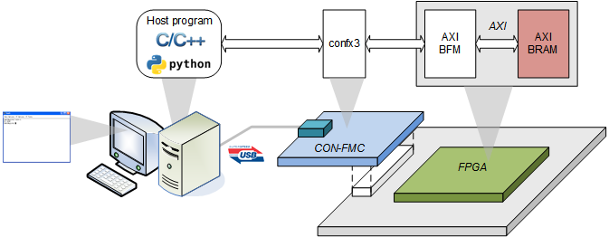

# CON-FMCTM Examples
These examples are prepared in the hope that it will be useful to understand Future Design Systems’ **CON-FMC**, but WITHOUT ANY WARRANTY. The design is not guaranteed to work on all systems. No technical support will be provided for problems that might arise

## License
**Copyright 2018-2019 Future Design Systems, Inc.** 
This is licensed with the 2-clause BSD license to make the program and library useful in open and closed source products independent of their licensing scheme. 
Each contributor holds copyright over their respective contributions.

# 1. fex_0001_loopback
*To be added*

# 2. [fex_002_amba_ahb_mem](fex_0002_amba_ahb_mem/README.md)
This example tests memory in the FPGA through USB.

# 3. [fex_0003_amba_axi_mem](fex_0003_amba_axi_mem/README.md)
This example tests memory in the FPGA through USB.

# 4. fex_0004_amba_axis
*To be added*

# 5. fex_0005_amba_ahb_sha256
*To be added*

# 6. fex_0006_amba_axi_aes
*To be added*

# 7. [fex_0007_amba_xfft](fex_0007_amba_axi_xfft/README.md)
This example tests Xilinx FFT.

---
## Contact
* <a href="http://www.future-ds.com" target="_blank">**Future Design Systems**</a>
* **[contact@future-ds.com](mailto:contact@future-ds.com)**
