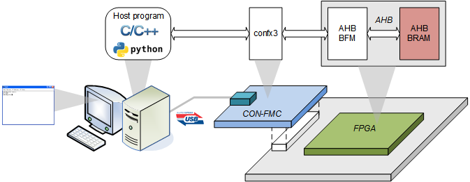
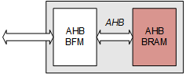
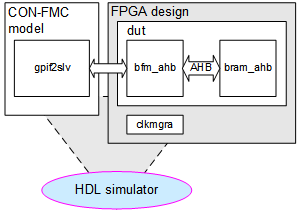
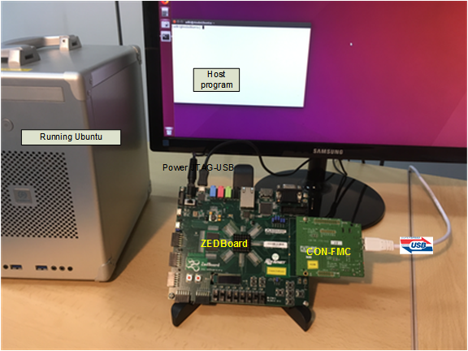

# CON-FMC<sup>TM</sup> with AMBA AHB MEM
This example writes and reads memory in the FPGA through USB along with Future Design Systems' CON-FMC.



## License
**Copyright 2018-2019 Future Design Systems, Inc.**<br>
This is licensed with the 2-clause BSD license to make the program and library useful in open and closed source products independent of their licensing scheme.<br>
Each contributor holds copyright over their respective contributions.

This example is prepared in the hope that it will be useful to understand Future Design Systems’ CON-FMC, but WITHOUT ANY WARRANTY. The design is not guaranteed to work on all systems.
No technical support will be provided for problems that might arise

## Prerequisites
This example requires followings.
* Shell: Bash
* GNU GCC: C compiler
* HDL simulator: Mentor Graphics ModelSim
* FPGA development: Xilinx ISE or Vivado depending on your FPGA board
* FPGA board: Xilinx FPGA mounted board with FMC
* Future Design Systems CON-FMC board
* Future Design Systems CON-FMC SW package
* Python

## Maturity
* RTL simulation
* FPGA proven (refer to [CON-FMC](#con_fmc))

# 1. <a name="environment"></a>Check or prepare environment

<details><summary>Click to expand</summary>

### 1.1 CON-FMC
This example requires CON-FMC software package.
If CON-FMC SW pkg is installed on */opt/confmc/2019.04*,
then source following script. (The directory should reflect actual one.)

    $ source /opt/confmc/2019.04/setting.sh

### 1.2 Xilinx
This example requires Xilinx development package; ISE or Vivado depending on FPGA type.

If Xilinx ISE pkg is installed on */opt/Xilinx/14.7*,
then source following script.

    $ source /opt/Xilinx/14.7/ISE_DS/settings64.sh

If Xilinx Vivado pkg is installed on */opt/Xilinx/Vivado/2018.3*,
then source following script.

    $ source /opt/Xilinx/Vivado/2018.3/settings64.sh

### 1.3 HDL simulator
This example uses one of following HDL simulators to run simulation.
* Mentor Graphics ModelSim or QuestaSim
* Xilinx Vivado Simulator (xsim)
* Icarus Verilog

### 1.4 LibUsb
The CON-FMC pkg uses LibUSB package and it can be checked as follows.

    $ ldconfig -p | grep libusb

If it is not installed, install it as follows.

    $ sudo apt-get install libusb-1.0.0-dev

</details>

# 2. Internal design
Following picture shows a rough structure of the design.



Host program generates AMBA AHB bus transactions on the bus in the FPGA, where
the host program can be in C or Python.

### 2.1 Directory structure

<details><summary>Click to expand</summary>

```
```
</details>


# 3. Prepare IP
This example uses following module.

  * mem_ahb

<details><summary>Click to expand</summary>

This step requires Xilinx package and you should reflect the correct version if the version is not *2018.3*.

This step uses Avnet ZedBoard and you should reflect the correct one if the board is not the same.
The ZedBoard has Zynq7000 series FPGA and 'z7' indicates FPGA type Zynq7000.

### 3.1 mem_ahb
It is a memory with AMBA AHB utilizing Xilinx dual-port BRAM.
This example uses 8Kbyte size of memory.

  1. go to 'iplib/mem_ahb/bram_simple_dual_port' directory<br>
     ```
     $ cd iplib/mem_ahb/bram_simple_dual_port
     ```
  2. further down to sub-directory implying FPGA type<br>
     ```
     $ cd z7
     ```
  3. further down to sub-directory for version of Xilinx package<br>
     ```
     $ cd vivado.2018.3
     ```
  4. run 'make'<br>
     ```
     $ make
     ```
The 'make' takes time and prepares all necessary Xilinx dual-port BRAM.
You can change memory size as follows.

* Change 'MEM_SIZE" macro in 'hw.single/design/verilog/fpga.v'
    * It will be 8\*1024, i.e, 8Kbyte.
* Prepare dual-port bram if not ready
    * iplib/mem_ahb/bram_simple_dual_port
* Add corresponding code in the 'mem_ahb'
    * iplib/mem_ahb/rtl/verilog/bram_ahb.v
* Verify your design using simulator
* Add corresponding XCI
    * hw.single/pnr/vivado.zed.lpc/vivado_run.tcl
* Run synthesis and implementation.

</details>

# 4. Simulation
This example includes RTL simulation and following steps are for ZedBoard.




### 4.1 Xilinx Vivado Simulator

<details><summary>Click to expand</summary>

  1. go to 'hw.single/sim/xsim'
  2. 'BOARD_ZED' macro should be defined in 'sim_define.v' file.
  3. run 'make'<br>
     ```
     $ make
     ```
     For more details, have a look at 'Makefile'.
  4. check simulation result by viewing 'wave.vcd'
     ```
     $ gtkwave wave.vcd
     ```
     This step requires VCD viewer, for example GTKwave.

You can add or modify testing scenario by updating 'gpif2slv.v' in 'hw.single/beh/verilog' directory.
</details>

### 4.2 Mentor Graphics ModelSim or QuestaSim

<details><summary>Click to expand</summary>

  1. go to 'hw.single/sim/modelsim.vivado
  2. 'BOARD_ZED' macro should be defined in 'sim_define.v' file.
  3. run 'make'<br>
     ```
     $ make
     ```
     For more details, have a look at 'Makefile'.
  4. check simulation result by viewing 'wave.vcd'
     ```
     $ gtkwave wave.vcd
     ```
     This step requires VCD viewer, for example GTKwave.
</details>

# 5. FPGA implementation

<details><summary>Click to expand</summary>

### 5.1 Vivado case
Following steps are for ZedBoard.

  1. go to 'hw.single/pnr/vivado.zed.lpc'
  2. run 'make'<br>
     ```
     $ make
     ```
  3. 'fpga.bit' should be ready

You can change size of memory by modifying 'MEM_SIZE' in 'hw.single/pnr/vivado.zed.lpc'.

### 5.2 ISE case
Following steps are for ML605.

  1. go to 'hw.single/syn/xst.v6'
  2. run 'make'<br>
     ```
     $ make
     ```
  3. 'fpga.ngc' should be ready
  4. got to 'hw.single/pnr/ise.ml605.lpc'
  5. run 'make'<br>
     ```
     $ make
     ```
  6. 'fpga.bit' should be ready

You can change size of memory by modifying 'MEM_SIZE' in 'hw.single/pnr/vivado.zed.lpc'.
</details>

# 6. Running with C program

### 6.1 Vivado case
This step runs C program along with FPGA board as shown in the picture below.
This example uses the FMC connector on Avnet ZedBoard.



<details><summary>Click to expand</summary>

#### 6.1.1 Linux

  1. make sure all connections are ready
     * board power turned off
     * connect USB-to-JTAG to the host computer
     * connect CON-FMC to the host computer
     * board power turned on
     * check CON-FMC is detected as follows
       ```
       $ lsusb
       ```
       This command should display something like below, where '04b4:00f3' is important,
       which indicates CON-FMC.
       ```
       ...
       Bus 005 Device 087: ID 04b4:00f3 Cypress Semiconductor Corp.
       ...
       ```
  2. program FPGA<a name="program-vivado"></a>
     This step requires Xilinx Vivado package. Refer to [environment](#environment).
     1. go to 'hw.single/pnr/vivado.zed.lpc/download'
     2. run 'make'
        ```
        $ make
        ```
        You can use Xilinx Vivado HW manager if you like.
     3. make sure that the configuration down LED lit.
  3. compile C program
     1. got to 'sw.native/test_mem'
     2. run 'make'
        ```
        $ make
        ```
     3. make sure that 'test' program is ready without any errors.
  4. run the program
     This step requires CON-FMC SW pkg. Refer to [environment](#environment).
     1. run 'test' with '-h' option to see options
        ```
        $ ./test -h
        ```
     2. run 'test'
        ```
        $ ./test -c 0 -m 0:0x8000 -l 2 -v 3
        ```
        * '-c 0' should reflect CON-FMC CID.
        * '-m 0:0x8000' indicates memory testing from 0x0 to 0x0+0x8000 upward.
        * '-l 2' level of memory test
        * '-v 3' level of verbosity
     3. now follow on-screen instruction

#### 6.1.2 Windows Visual Studio

  1. make sure all connections are ready
     * board power turned off
     * connect USB-to-JTAG to the host computer
     * connect CON-FMC to the host computer
     * board power turned on
     * check CON-FMC is detected as follows
       
  2. program FPGA<a name="program-vivado"></a>
     This step requires Xilinx Vivado package. Refer to [environment](#environment).
     1. go to 'hw.single/pnr/vivado.zed.lpc'
     2. download 'fpga.bit' using Vivado HW Manager
     3. make sure that the configuration down LED lit.
  3. compile C program
     1. set 'CONFMC_HOME' environment variable indicating where CON-FMC package is installed<br>
        E.g., C:\confmc\2019.05<br>
     2. got to 'sw.native/test_mem/Project1'
     2. invoke Visual Studio
     3. make sure that 'Project1.exe' program is ready without any errors.<br>
        one of followings should be ready depending on your setting<br>
        ```
        Project1\Project1\Debug\Project1.exe
        Project1\Project1\Release\Project1.exe
        Project1\Project1\x64\Debug\Project1.exe
        Project1\Project1\x64\Release\Project1.exe
        ```
  4. run the program
     This step requires CON-FMC SW pkg. Refer to [environment](#environment).<br>
     You may need Windows Command Window to run the program.
     1. run 'Project1.exe' with '-h' option to see options
        ```
        > Project1.exe -h
        ```
     2. run 'Project1.exe'
        ```
        > Project1.exe -c 0 -m 0:0x8000 -l 2 -v 3
        ```
        * '-c 0' should reflect CON-FMC CID.
        * '-m 0:0x8000' indicates memory testing from 0x0 to 0x0+0x8000 upward.
        * '-l 2' level of memory test
        * '-v 3' level of verbosity
     3. now follow on-screen instruction

</details>

### 6.2 ISE case
This step runs C program along with FPGA board as shown in the picture below.
Xilinx ML605 has two FMC connector; one for HPC and the other is LPC.
CON-FMC can be mounted on any FMC and this example uses LPC.


<details><summary>Click to expand</summary>

#### 6.2.1 Linux

  1. make sure all connections are ready
     * board power turned off
     * connect USB-to-JTAG to the host computer
     * connect CON-FMC to the host computer
     * board power turned on
     * check CON-FMC is detected as follows
       ```
       $ lsusb
       ```
       This command should display something like below, where '04b4:00f3' is important,
       which indicates CON-FMC.
       ```
       ...
       Bus 005 Device 087: ID 04b4:00f3 Cypress Semiconductor Corp.
       ...
       ```
  2. program FPGA<a name="program-ise"></a>
     This step requires Xilinx ISE package. Refer to [environment](#environment).
     1. go to 'hw.single/pnr/ise.ml605.lpc/impact'
     2. run 'make'
        ```
        $ make
        ```
        You can use Xilinx iMPACT if you like.
     3. make sure that the configuration down LED lit.
  3. compile C program
     1. got to 'sw.native/test_mem'
     2. run 'make'
        ```
        $ make
        ```
     3. make sure that 'test' program is ready without any errors.
  4. run the program
     This step requires CON-FMC SW pkg. Refer to [environment](#environment).
     1. run 'test' with '-h' option to see options
        ```
        $ ./test -h
        ```
     2. run 'test'
        ```
        $ ./test -c 0 -m 0:0x8000 -l 2 -v 3
        ```
        * '-c 0' should reflect CON-FMC CID.
        * '-m 0:0x8000' indicates memory testing from 0x0 to 0x8000 upward.
        * '-l 2' level of memory test
        * '-v 3' level of verbosity
     3. now follow on-screen instruction

#### 6.2.2 Windows Visual Studio
Refer to '6.1.2 Windows Visual Studio'.

</details>

# 7. Running with Python
This step uses Python to read and write memory in the FPGA.<br>
First of all, the FPGA should be programmed with correct bit-stream and 
see [program Vivado](#program-vivado) or [program Ise](#program-ise).<br>
This feature is supported for Linux at this moment.

<details><summary>Click to expand</summary>

  1. go to 'python' directory under the project
     ```
     $ cd python
     ```
     Note 'python' is not system directory, but testing sub-directory under the project directory.
  2. check options
     ```
     $ python test_mem.py -h
     CONFMC_HOME:/opt/confmc/2019.04
     DIR:/opt/confmc/2019.04/lib/linux_x86_64
     API:/opt/confmc/2019.04/lib/linux_x86_64/libconapi.so
     /opt/confmc/2019.04/lib/linux_x86_64/libconapi.so found.
     /opt/confmc/2019.04/hwlib/trx_ahb/lib/linux_x86_64/libbfmahb.so found.
     ./test_mem.py -c <card_id>
     ```
  3. run with correct card id and following is for CID 0.
     ```
     $ python test_mem.py -c 0
     python test_mem.py 
     CONFMC_HOME:/opt/confmc/2019.04
     DIR:/opt/confmc/2019.04/lib/linux_x86_64
     API:/opt/confmc/2019.04/lib/linux_x86_64/libconapi.so
     /opt/confmc/2019.04/lib/linux_x86_64/libconapi.so found.
     /opt/confmc/2019.04/hwlib/trx_ahb/lib/linux_x86_64/libbfmahb.so found.
     CON-FMC: CID0 found.
     Compare Wdata:Rdatra  [305419896, 2271560481] : [305419896L, 2271560481L]
     Compare Wdata:Rdata  [305419896, 2271560481, 286331153, 572662306] : [572662306L, 572662306L, 572662306L, 572662306L]
     MemTestAddRAW 256 OK
     MemTestAdd 256 OK
     MemTestRAW size 4 256 OK
     MemTestRAW size 2 256 OK
     MemTestRAW size 1 256 OK
     MemTest size 4 256 OK
     MemTest size 2 256 OK
     MemTest size 1 256 OK
     MemTestBurstRAW burst 10 512 OK
     MemTestBurst burst 10 512 OK
     MemTestBurst burst 20 1024 OK
     ```
</details>

# Other things

---
### Author(s)
* **[Ando Ki](mailto:contact@future-ds.com)** - *Initial work* - <a href="http://www.future-ds.com" target="_blank">Future Design Systems</a>

### Acknowledgments

