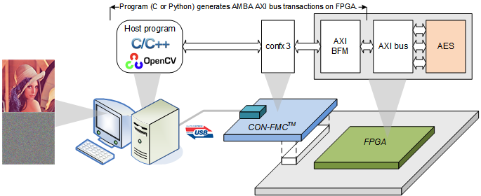
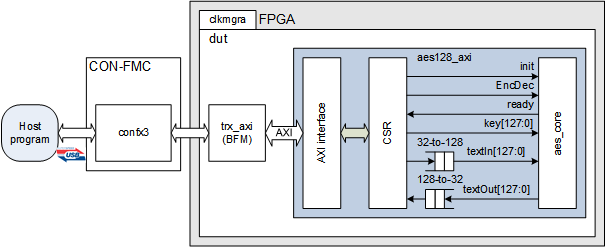
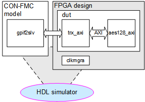

# CON-FMC with AES
This example runs AES (Pipelined Advanced Encryption Standard 128 Rijndael) along with Future Design Systems' CON-FMC.



## License
**Copyright 2018-2019 Future Design Systems, Inc.**<br>
This is licensed with the 2-clause BSD license to make the program and library useful in open and closed source products independent of their licensing scheme.<br>
Each contributor holds copyright over their respective contributions.

This example is prepared in the hope that it will be useful to understand Future Design Systems’ CON-FMC, but WITHOUT ANY WARRANTY. The design is not guaranteed to work on all systems. No technical support will be provided for problems that might arise


## Prerequisites
This example requires followings.
* Shell: Bash
* GNU GCC: C compiler
* HDL simulator: Mentor Graphics ModelSim
* FPGA development: Xilinx ISE or Vivado
* FPGA board: Xilinx FPGA mounted board with FMC
* Future Design Systems CON-FMC board
* Future Design Systems CON-FMC SW package
* OpenCV
* Gnuplot

## Maturity
* RTL simulation
* FPGA proven (refer to [CON-FMC](#con_fmc))

# 1. <a name="environment"></a>Check or prepare environment

<details><summary>Click to expand</summary>

### 1.1 CON-FMC
This example requires CON-FMC software package.
If CON-FMC SW pkg is installed on */opt/confmc/2019.05*,
then source following script. (The directory should reflect actual one.)

    $ source /opt/confmc/2019.05/setting.sh

### 1.2 Xilinx
This example requires Xilinx development package; ISE or Vivado depending on FPGA type.

If **Xilinx ISE** package is installed on */opt/Xilinx/14.7*,
then source following script.

    $ source /opt/Xilinx/14.7/ISE_DS/settings64.sh

If **Xilinx Vivado** package is installed on */opt/Xilinx/Vivado/2018.3*,
then source following script, where *2018.3* should reflect the version of yours.

    $ source /opt/Xilinx/Vivado/2018.3/settings64.sh

### 1.3 HDL simulator
This example uses one of following HDL simulators to run simulation.
* Mentor Graphics ModelSim or QuestaSim
* Xilinx Vivado Simulator (xsim)
* Icarus Verilog

### 1.4 LibUsb
The CON-FMC pkg uses **LibUSB** package and it can be checked as follows.

    $ ldconfig -p | grep libusb

If it is not installed, install it as follows.

    $ sudo apt-get install libusb-1.0.0-dev

</details>

# 2. Internal design
Following picture shows a rough structure of the design, where *aes128_axi* block
is encrypted and contact  [Future Design Systems](mailto:contact@future-ds.com) if you need further information.



Host program generates AMBA AXI bus transactions on the bus in the FPGA, where
the host program can be in C or Python.

The host program runs as follows.

  1. initialize all HW components
  2. prepare signal data and write it to a file
  3. write 256 samples of 16-bit raw data in the first memory
  4. let stream2mem and mem2stream start
  5. wait for completion of FFT for 256 samples
  6. read 256 FFT results from the second memory, where each FFT result consists of 32-bit real and 32-bit imaginary
  7. write the FFT results to a file

### 2.1 Directory structure


<details><summary>Click to expand</summary>

```
To be added.
```
</details>

# 3. Prepare IP
This example uses following modules and it uses Xilinx IP internally.

  * aes128_axi

<details><summary>Click to expand</summary>

This step requires Xilinx package and you should reflect the correct version if the version is not *2018.3*.

This step uses Avnet ZedBoard and you should reflect the correct one if the board is not the same.
The ZedBoard has Zynq7000 series FPGA and 'z7' indicates FPGA type Zynq7000.

### 3.1 aes128_axi
It is an implementaion of **Pipelined Advanced Encryption Standard 128 Rijndael**
with AMBA AXI interface.

#### 3.1.1 Dual-port BRAM

  1. go to 'iplib/aes128_axi/mem_dual_port' directory<br />
     ```
     $ cd iplib/aes128_axi/mem_dual_port
     ```
  2. further down to sub-directory implying FPGA type on board<br />
     ```
     $ cd z7
     ```
  3. further down to sub-directory for version fo Xilinx package<br />
     ```
     $ cd vivado.2018.3
     ```
  4. run 'make'<br />
     ```
     $ make
     ```
The 'make' takes time and prepares Xilinx dual-port BRAM.

#### 3.1.2 Synchronous FIFO

  1. go to 'iplib/aes128_axi/fifo_sync' directory<br />
     ```
     $ cd iplib/aes128_axi/fifo_sync
     ```
  2. further down to sub-directory implying FPGA type on board<br />
     ```
     $ cd z7
     ```
  3. further down to sub-directory for version fo Xilinx package<br />
     ```
     $ cd vivado.2018.3
     ```
  4. run 'make'<br />
     ```
     $ make
     ```
The 'make' takes time and prepares Xilinx synchronous FIFO.

</details>

# 4. Simulation
This example includes RTL simulation and following steps are for ZedBoard.



This example does not support iVerilog and XSIM since CON-FMC model is not
prepare for those simulators yet.

### 4.1 Xilinx Vivado Simulator

<details><summary>Click to expand</summary>

  1. go to 'hw/sim/xsim'
  2. 'BOARD_ZED' macro should be defined in 'sim_define.v' file.
  3. run 'make'<br />
     ```
     $ make
     ```
     For more details, have a look at 'Makefile'.
  4. check simulation result by viewing 'wave.vcd'
     ```
     $ gtkwave wave.vcd
     ```
     This step requires VCD viewer, for example GTKwave.

You can add or modify testing scenario by updating 'gpif2slv.v' in 'hw/beh/verilog' directory.
You can add or modify input signals by updating 'adc_tasks.v' in 'hw/beh/verilog' directory.
</details>

### 4.2 Mentor Graphics ModelSim or QuestaSim
For Mentor Graphics ModelSim or QuestaSim, it uses dummy XFFT model since
XFFT (Xilinx FFT) block uses protected code and it requires the latest simulator.

<details><summary>Click to expand</summary>

  1. go to 'hw/sim/modelsim.vivado
  2. 'BOARD_ZED' macro should be defined in 'sim_define.v' file.
  3. run 'make'<br />
     ```
     $ make
     ```
     For more details, have a look at 'Makefile'.
  4. check simulation result by viewing 'wave.vcd'
     ```
     $ gtkwave wave.vcd
     ```
     This step requires VCD viewer, for example GTKwave.

You can add or modify testing scenario by updating 'gpif2slv.v' in 'hw/beh/verilog' directory.
You can add or modify input signals by updating 'adc_tasks.v' in 'hw/beh/verilog' directory.
</details>

# 5. FPGA implementation

### 5.1 Vivado case
Following steps are for ZedBoard.

  1. go to 'hw/pnr/vivado.zed.lpc'
  2. run 'make'<br />
     ```
     $ make
     ```
  3. 'fpga.bit' should be ready

### 5.2 ISE case (not added yet)

# 6. Running with C program


### 6.1 Vivado case
This step runs C program along with FPGA board as shown in the picture below.

<details><summary>Click to expand</summary>

  1. make sure all connections are ready
     * board power turned off
     * connect USB-to-JTAG to the host computer
     * connect CON-FMC to the host computer
     * board power turned on
     * check CON-FMC is detected as follows
       ```
       $ lsusb
       ```
       This command should display something like below, where '04b4:00f3' is important,
       which indicates CON-FMC.
       ```
       ...
       Bus 005 Device 087: ID 04b4:00f3 Cypress Semiconductor Corp.
       ...
       ```
  2. program FPGA<a name="program-vivado"></a>
     This step requires Xilinx Vivado package. Refer to [environment](#environment).
     1. go to 'hw/pnr/vivado.zed.lpc/download'
     2. run 'make'
        ```
        $ make
        ```
        You can use Xilinx Vivado HW manager if you like.
     3. make sure that the configuration down LED lit.
  3. compile C program
     1. got to 'sw.native/test_img_bmp'
     2. run 'make'
        ```
        $ make
        ```
     3. make sure that 'test' program is ready without any errors.
  4. run the program
     This step requires CON-FMC SW pkg. Refer to [environment](#environment).
     1. run 'test' with '-h' option to see options
        ```
        $ ./test -h
        [Usage] ./test [options]
             -c   cid    card id: 0
             -i   img    image file
             -b   num    burst length: 256
             -m   mod    0=SW, 3=HW, 1=HW-SW, 2=SW-HW: 0
             -r          compare result
             -v   num    verbose level (default: 0)
             -h          print help message
        ```
     2. run 'test'
        ```
        $ make run
        ./test -c 0 -i images/lena_512x512.bmp -m 0
        ```

</details>

### 6.2 ISE case (not added yet)

# Other things

---
### Author(s)
* **[Ando Ki](mailto:contact@future-ds.com)** - *Initial work* - <a href="http://www.future-ds.com" target="_blank">Future Design Systems</a>

### Acknowledgments

