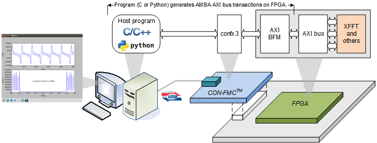
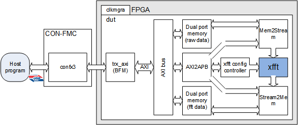
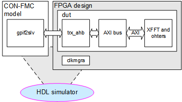
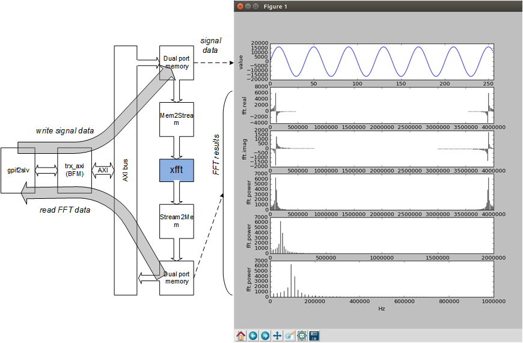
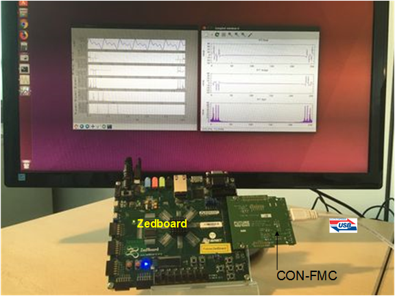
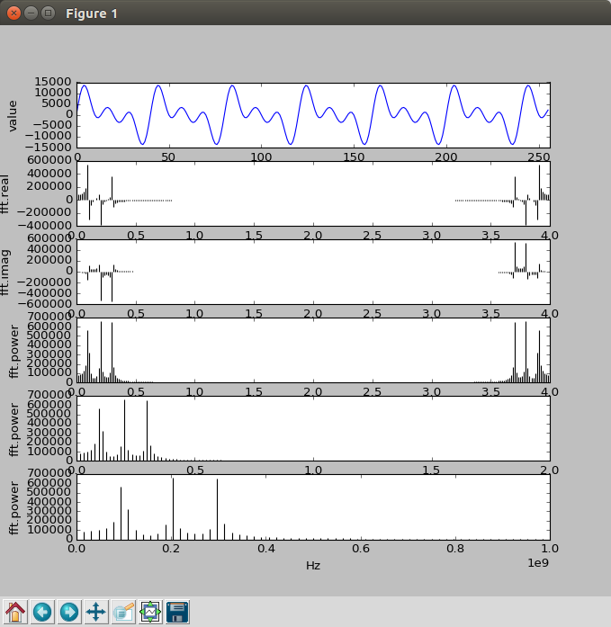
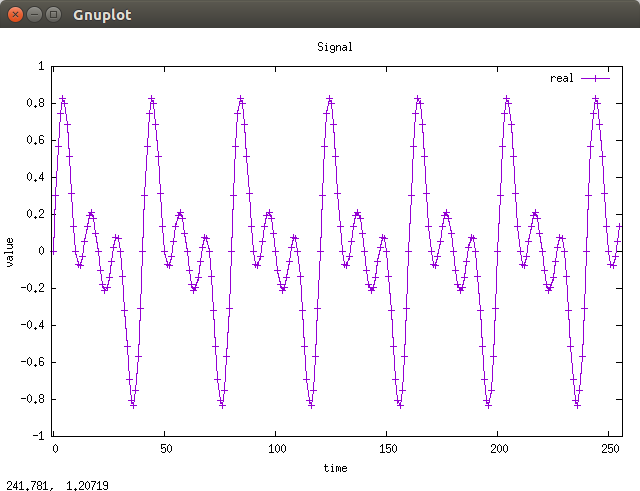
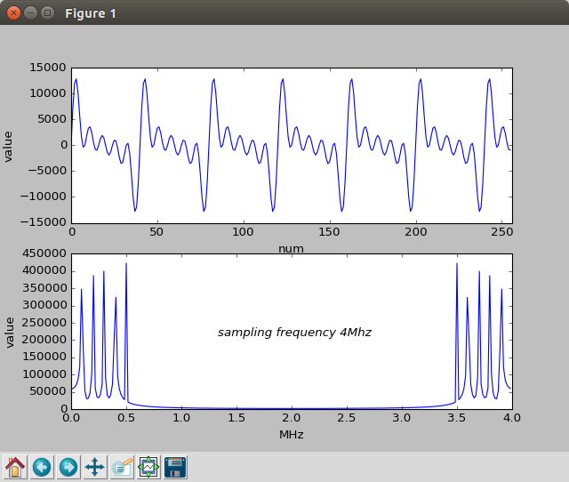

# CON-FMC with XFFT
This example runs Xilinx FFT (Fast Fourier Transform) along with Future Design Systems' CON-FMC.



## License
**Copyright 2018-2019 Future Design Systems, Inc.**<br>
This is licensed with the 2-clause BSD license to make the program and library useful in open and closed source products independent of their licensing scheme.<br>
Each contributor holds copyright over their respective contributions.

This example is prepared in the hope that it will be useful to understand Future Design Systems’ CON-FMC, but WITHOUT ANY WARRANTY. The design is not guaranteed to work on all systems. No technical support will be provided for problems that might arise


## Prerequisites
This example requires followings.
* Shell: Bash
* GNU GCC: C compiler
* HDL simulator: Mentor Graphics ModelSim
* FPGA development: Xilinx ISE or Vivado
* FPGA board: Xilinx FPGA mounted board with FMC
* Future Design Systems CON-FMC board
* Future Design Systems CON-FMC SW package
* Python with Matplotlib and SciPy
* Gnuplot

## Maturity
* RTL simulation
* FPGA proven (refer to [CON-FMC](#con_fmc))

# 1. <a name="environment"></a>Check or prepare environment

<details><summary>Click to expand</summary>

### 1.1 CON-FMC
This example requires CON-FMC software package.
If CON-FMC SW pkg is installed on */opt/confmc/2019.05*,
then source following script. (The directory should reflect actual one.)

    $ source /opt/confmc/2019.05/setting.sh

### 1.2 Xilinx
This example requires Xilinx development package; ISE or Vivado depending on FPGA type.

If **Xilinx ISE** package is installed on */opt/Xilinx/14.7*,
then source following script.

    $ source /opt/Xilinx/14.7/ISE_DS/settings64.sh

If **Xilinx Vivado** package is installed on */opt/Xilinx/Vivado/2018.3*,
then source following script, where *2018.3* should reflect the version of yours.

    $ source /opt/Xilinx/Vivado/2018.3/settings64.sh

### 1.3 HDL simulator
This example uses one of following HDL simulators to run simulation.
* Mentor Graphics ModelSim or QuestaSim
* Xilinx Vivado Simulator (xsim)
* Icarus Verilog

### 1.4 LibUsb
The CON-FMC pkg uses **LibUSB** package and it can be checked as follows.

    $ ldconfig -p | grep libusb

If it is not installed, install it as follows.

    $ sudo apt-get install libusb-1.0.0-dev

</details>

# 2. Internal design
Following picture shows a rough structure of the design.



Host program generates AMBA AXI bus transactions on the bus in the FPGA, where
the host program can be in C or Python.

The host program runs as follows.

  1. initialize all HW components
  2. prepare signal data and write it to a file
  3. write 256 samples of 16-bit raw data in the first memory
  4. let stream2mem and mem2stream start
  5. wait for completion of FFT for 256 samples
  6. read 256 FFT results from the second memory, where each FFT result consists of 32-bit real and 32-bit imaginary
  7. write the FFT results to a file

### 2.1 Directory structure


<details><summary>Click to expand</summary>

```
.
├── Clean.bat
├── Clean.csh
├── Clean.sh
├── doc
│   └── fex_0007_xfft_project_20190505.pdf
├── HowToRun.txt
├── hw
│   ├── beh
│   │   └── verilog
│   │       ├── adc_tasks.v
│   │       ├── fft_model_fixed.v
│   │       ├── file_writer_fixed.v
│   │       ├── gpif2if_fifo_sync.v
│   │       ├── gpif2slv_tasks.v
│   │       ├── gpif2slv_trx_axi_tasks.v
│   │       ├── gpif2slv.v
│   │       ├── INDEX.txt
│   │       ├── stream_tasks.v
│   │       └── xfft_16bit256samples_dummy.v
│   ├── bench
│   │   └── verilog
│   │       ├── top_gpif2slv.v
│   │       ├── top.v
│   │       └── top_zed.v
│   ├── Clean.bat
│   ├── Clean.csh
│   ├── Clean.sh
│   ├── design
│   │   └── verilog
│   │       ├── clkmgra.v
│   │       ├── defines_system.v
│   │       ├── dut_apb_bus.v
│   │       ├── dut_axi_bus.v
│   │       ├── dut_axi_peri.v
│   │       ├── dut.v
│   │       ├── fpga.v
│   │       ├── fpga_zed.v
│   │       └── memory_map.txt
│   ├── Makefile
│   ├── pnr
│   │   ├── Clean.bat
│   │   ├── Clean.csh
│   │   ├── Clean.sh
│   │   ├── Makefile
│   │   └── vivado.zedboard
│   │       ├── additional.xdc
│   │       ├── Clean.bat
│   │       ├── Clean.csh
│   │       ├── Clean.sh
│   │       ├── download
│   │       │   ├── Makefile
│   │       │   └── vivado_down.tcl
│   │       ├── Makefile
│   │       ├── syn_define.v
│   │       ├── vivado_run.tcl
│   │       └── xdc
│   │           ├── con-fmc_lpc_zed.xdc
│   │           ├── fpga_etc.xdc
│   │           └── fpga_zed.xdc
│   └── sim
│       ├── Clean.bat
│       ├── Clean.csh
│       ├── Clean.sh
│       ├── Makefile
│       ├── modelsim.vivado
│       │   ├── Clean.bat
│       │   ├── Clean.csh
│       │   ├── Clean.sh
│       │   ├── Makefile
│       │   ├── modelsim.args
│       │   ├── modelsim_bench.args
│       │   ├── modelsim_dut.args
│       │   ├── plot_data.plt
│       │   ├── plot_fft_one.plt
│       │   ├── plot_fft.plt
│       │   ├── plot.py
│       │   ├── plot_twiddle.plt
│       │   └── sim_define.v
│       └── xsim
│           ├── Clean.bat
│           ├── Clean.csh
│           ├── Clean.sh
│           ├── Makefile
│           ├── sim_define.v
│           ├── xsim.prj
│           └── xsim_run.tcl
├── iplib
│   ├── amba_axi
│   │   └── rtl
│   │       └── verilog
│   │           └── amba_axi_m2s3.v
│   ├── axi_mem2stream
│   │   ├── api
│   │   │   ├── c
│   │   │   │   ├── axi_mem2stream_api.c
│   │   │   │   └── axi_mem2stream_api.h
│   │   │   └── python
│   │   │       └── axi_mem2stream_api.py
│   │   ├── bench
│   │   │   └── verilog
│   │   │       ├── apb_tasks.v
│   │   │       ├── bfm_apb.v
│   │   │       ├── mem_axi_dpram_sync.v
│   │   │       ├── mem_axi.v
│   │   │       └── top.v
│   │   ├── Clean.bat
│   │   ├── Clean.csh
│   │   ├── Clean.sh
│   │   ├── doc
│   │   │   └── axi_mem2stream.pdf
│   │   ├── fifo_async
│   │   │   ├── Clean.bat
│   │   │   ├── Clean.csh
│   │   │   ├── Clean.sh
│   │   │   ├── Makefile
│   │   │   └── z7
│   │   │       ├── Clean.bat
│   │   │       ├── Clean.csh
│   │   │       ├── Clean.sh
│   │   │       ├── Makefile
│   │   │       └── vivado.2018.3
│   │   │           ├── Clean.bat
│   │   │           ├── Clean.csh
│   │   │           ├── Clean.sh
│   │   │           ├── Makefile
│   │   │           └── vivado_ip_project_fifo.tcl
│   │   ├── Makefile
│   │   ├── rtl
│   │   │   └── verilog
│   │   │       ├── axi_mem2stream_core_xsim.vp
│   │   │       ├── axi_mem2stream_csr_apb_xsim.vp
│   │   │       ├── axi_mem2stream_csr_xsim.vp
│   │   │       ├── axi_mem2stream_defines_xsim.vp
│   │   │       ├── axi_mem2stream_modelsim_vivado.vp
│   │   │       ├── axi_mem2stream_stub.v
│   │   │       ├── axi_mem2stream_sync_xsim.vp
│   │   │       ├── axi_mem2stream_vivado.vm
│   │   │       └── axi_mem2stream_xsim.vp
│   │   └── syn
│   │       └── vivado.z7
│   │           └── axi_mem2stream.edif
│   ├── axi_stream2mem
│   │   ├── api
│   │   │   ├── c
│   │   │   │   ├── axi_stream2mem_api.c
│   │   │   │   └── axi_stream2mem_api.h
│   │   │   └── python
│   │   │       └── axi_stream2mem_api.py
│   │   ├── bench
│   │   │   └── verilog
│   │   │       ├── apb_tasks.v
│   │   │       ├── bfm_apb.v
│   │   │       ├── mem_axi_dpram_sync.v
│   │   │       ├── mem_axi.v
│   │   │       └── top.v
│   │   ├── Clean.bat
│   │   ├── Clean.csh
│   │   ├── Clean.sh
│   │   ├── doc
│   │   │   └── axi_stream2mem.pdf
│   │   ├── fifo_async
│   │   │   ├── Clean.bat
│   │   │   ├── Clean.csh
│   │   │   ├── Clean.sh
│   │   │   ├── Makefile
│   │   │   └── z7
│   │   │       ├── Clean.bat
│   │   │       ├── Clean.csh
│   │   │       ├── Clean.sh
│   │   │       ├── Makefile
│   │   │       └── vivado.2018.3
│   │   │           ├── Clean.bat
│   │   │           ├── Clean.csh
│   │   │           ├── Clean.sh
│   │   │           ├── Makefile
│   │   │           └── vivado_ip_project_fifo.tcl
│   │   ├── Makefile
│   │   ├── rtl
│   │   │   └── verilog
│   │   │       ├── axi_stream2mem_core_xsim.vp
│   │   │       ├── axi_stream2mem_csr_apb_xsim.vp
│   │   │       ├── axi_stream2mem_csr_xsim.vp
│   │   │       ├── axi_stream2mem_defines_xsim.vp
│   │   │       ├── axi_stream2mem_modelsim_vivado.vp
│   │   │       ├── axi_stream2mem_stub.v
│   │   │       ├── axi_stream2mem_sync_xsim.vp
│   │   │       ├── axi_stream2mem_vivado.vm
│   │   │       └── axi_stream2mem_xsim.vp
│   │   └── syn
│   │       └── vivado.z7
│   │           └── axi_stream2mem.edif
│   ├── axi_to_apb
│   │   └── rtl
│   │       └── verilog
│   │           └── axi_to_apb_s3.v
│   ├── Clean.bat
│   ├── Clean.csh
│   ├── Clean.sh
│   ├── Makefile
│   ├── mem_axi_dual
│   │   ├── bram_true_dual_port
│   │   │   ├── Clean.bat
│   │   │   ├── Clean.csh
│   │   │   ├── Clean.sh
│   │   │   ├── Makefile
│   │   │   └── z7
│   │   │       ├── Clean.bat
│   │   │       ├── Clean.csh
│   │   │       ├── Clean.sh
│   │   │       ├── Makefile
│   │   │       └── vivado.2018.3
│   │   │           ├── Clean.bat
│   │   │           ├── Clean.csh
│   │   │           ├── Clean.sh
│   │   │           ├── Makefile
│   │   │           └── vivado_ip_project_bram.tcl
│   │   └── rtl
│   │       └── verilog
│   │           └── bram_axi_dual.v
│   ├── xfft
│   │   ├── Clean.bat
│   │   ├── Clean.csh
│   │   ├── Clean.sh
│   │   ├── Makefile
│   │   └── z7
│   │       ├── Clean.bat
│   │       ├── Clean.csh
│   │       ├── Clean.sh
│   │       ├── Makefile
│   │       └── vivado.2018.3
│   │           ├── Clean.bat
│   │           ├── Clean.csh
│   │           ├── Clean.sh
│   │           ├── Makefile
│   │           └── vivado_ip.tcl
│   └── xfft_config
│       ├── api
│       │   ├── c
│       │   │   ├── xfft_config_api.c
│       │   │   └── xfft_config_api.h
│       │   └── python
│       │       └── xfft_config_api.py
│       ├── Clean.bat
│       ├── Clean.csh
│       ├── Clean.sh
│       ├── doc
│       │   └── xfft_config.pdf
│       ├── Makefile
│       ├── rtl
│       │   └── verilog
│       │       ├── xfft_config_modelsim_vivado.vp
│       │       ├── xfft_config_stub.v
│       │       ├── xfft_config_vivado.vm
│       │       └── xfft_config_xsim.vp
│       └── syn
│           └── vivado.z7
│               └── xfft_config.edif
├── Makefile
├── python
│   ├── Makefile
│   ├── test_mem.py
│   └── test_xfft.py
└── sw.native
    ├── Clean.bat
    ├── Clean.csh
    ├── Clean.sh
    ├── Makefile
    ├── Makefile.in
    ├── test_mem
    │   ├── Clean.bat
    │   ├── Clean.csh
    │   ├── Clean.sh
    │   ├── Makefile
    │   └── src
    │       ├── arg_parser.c
    │       ├── main.c
    │       ├── mem_api.c
    │       ├── mem_api.h
    │       ├── memory_map.h
    │       └── test_bench.c
    └── test_xfft
        ├── Clean.bat
        ├── Clean.csh
        ├── Clean.sh
        ├── Makefile
        └── src
            ├── arg_parser.c
            ├── fft.c
            ├── fft.h
            ├── main.c
            ├── mem_api.c
            ├── mem_api.h
            ├── memory_map.h
            └── test_bench.c
```

</details>

# 3. Prepare IP
This example uses following modules and each of this module uses Xilinx IP internally.

  * mem_axi_dual
  * axi_mem2stream
  * axi_stream2mem
  * xfft
  * amba_axi
  * axi_to_apb

<details><summary>Click to expand</summary>

This step requires Xilinx package and you should reflect the correct version if the version is not *2018.3*.

This step uses Avnet ZedBoard and you should reflect the correct one if the board is not the same.
The ZedBoard has Zynq7000 series FPGA and 'z7' indicates FPGA type Zynq7000.

### 3.1 mem_axi_dual
It is a memory with AMBA AXI providing dual ports.

  1. go to 'iplib/mem_axi_dual/bram_true_dual_port' directory<br />
     ```
     $ cd iplib/mem_axi_dual/bram_true_dual_port
     ```
  2. further down to sub-directory implying FPGA type<br />
     ```
     $ cd z7
     ```
  3. further down to sub-directory for version fo Xilinx package<br />
     ```
     $ cd vivado.2018.3
     ```
  4. run 'make'<br />
     ```
     $ make
     ```
The 'make' takes time and prepares Xilinx dual-port BRAM.

### 3.2 axi_mem2stream
It reads data through AMBA AXI memory-mapped interface and puts AMBA AXI stream.
For more information, refer to document in 'iplib/axi_mem2stream/doc' directory.

  1. go to 'iplib/axi_mem2stream/fifo_async' directory<br />
     ```
     $ cd iplib/axi_mem2stream/fifo_async
     ```
  2. further down to sub-directory implying FPGA type<br />
     ```
     $ cd z7
     ```
  3. further down to sub-directory for version fo Xilinx package<br />
     ```
     $ cd vivado.2018.3
     ```
  4. run 'make'<br />
     ```
     $ make
     ```
The 'make' takes time and prepares Xilinx asynchronous FIFO.

### 3.3 axi_stream2mem
It receives data through AMBA AXI stream and write it through AMBA AXI memory-mapped interface.
For more information, refer to document in 'iplib/axi_stream2mem/doc' directory.

  1. go to 'iplib/axi_stream2mem/fifo_async' directory<br />
     ```
     $ cd iplib/axi_stream2mem/fifo_async
     ```
  2. further down to sub-directory implying FPGA type<br />
     ```
     $ cd z7
     ```
  3. further down to sub-directory for version fo Xilinx package<br />
     ```
     $ cd vivado.2018.3
     ```
  4. run 'make'<br />
     ```
     $ make
     ```
The 'make' takes time and prepares Xilinx asynchronous FIFO.

### 3.4 xfft
It is Xilinx FFT IP, which gets 256 samples of 16-bit signal data and puts 256 samples of 32-bit/32-bit real/imaginary FFT results.

  1. go to 'iplib/xfft' directory<br />
     ```
     $ cd iplib/xfft
     ```
  2. further down to sub-directory implying FPGA type<br />
     ```
     $ cd z7
     ```
  3. further down to sub-directory for version fo Xilinx package<br />
     ```
     $ cd vivado.2018.3
     ```
  4. run 'make'<br />
     ```
     $ make
     ```
The 'make' takes time and prepares Xilinx FFT.

### 3.5 amba_axi and axi_to_apb
These blocks can be prepared by [GEN_AMBA](https://github.com/adki/gen_amba).

</details>

# 4. Simulation
This example includes RTL simulation and following steps are for ZedBoard.



This example does not support iVerilog and XSIM since CON-FMC model is not
prepare for those simulators yet.

### 4.1 Xilinx Vivado Simulator

<details><summary>Click to expand</summary>

  1. go to 'hw/sim/xsim'
  2. 'BOARD_ZED' macro should be defined in 'sim_define.v' file.
  3. run 'make'<br />
     ```
     $ make
     ```
     For more details, have a look at 'Makefile'.
  4. check simulation result by viewing 'wave.vcd'
     ```
     $ gtkwave wave.vcd
     ```
     This step requires VCD viewer, for example GTKwave.
  5. Check simulation result in terms of data
     ```
     $ make plot
     ```
     This step displays input data and FFT result using Python.

     

You can add or modify testing scenario by updating 'gpif2slv.v' in 'hw/beh/verilog' directory.
You can add or modify input signals by updating 'adc_tasks.v' in 'hw/beh/verilog' directory.
</details>

### 4.2 Mentor Graphics ModelSim or QuestaSim
For Mentor Graphics ModelSim or QuestaSim, it uses dummy XFFT model since
XFFT (Xilinx FFT) block uses protected code and it requires the latest simulator.

<details><summary>Click to expand</summary>

  1. go to 'hw/sim/modelsim.vivado
  2. 'BOARD_ZED' macro should be defined in 'sim_define.v' file.
  3. run 'make'<br />
     ```
     $ make
     ```
     For more details, have a look at 'Makefile'.
  4. check simulation result by viewing 'wave.vcd'
     ```
     $ gtkwave wave.vcd
     ```
     This step requires VCD viewer, for example GTKwave.
  5. Check simulation result in terms of data
     ```
     $ make plot
     ```
     This step displays input data and FFT result using Python.

You can add or modify testing scenario by updating 'gpif2slv.v' in 'hw/beh/verilog' directory.
You can add or modify input signals by updating 'adc_tasks.v' in 'hw/beh/verilog' directory.
</details>

# 5. FPGA implementation

### 5.1 Vivado case
Following steps are for ZedBoard.

  1. go to 'hw/pnr/vivado.zedboard'
  2. run 'make'<br />
     ```
     $ make
     ```
  3. 'fpga.bit' should be ready

### 5.2 ISE case (not added yet)

# 6. Running with C program



### 6.1 Vivado case
This step runs C program along with FPGA board as shown in the picture below.

<details><summary>Click to expand</summary>

  1. make sure all connections are ready
     * board power turned off
     * connect USB-to-JTAG to the host computer
     * connect CON-FMC to the host computer
     * board power turned on
     * check CON-FMC is detected as follows
       ```
       $ lsusb
       ```
       This command should display something like below, where '04b4:00f3' is important,
       which indicates CON-FMC.
       ```
       ...
       Bus 005 Device 087: ID 04b4:00f3 Cypress Semiconductor Corp.
       ...
       ```
  2. program FPGA<a name="program-vivado"></a>
     This step requires Xilinx Vivado package. Refer to [environment](#environment).
     1. go to 'hw/pnr/vivado.zedboard/download'
     2. run 'make'
        ```
        $ make
        ```
        You can use Xilinx Vivado HW manager if you like.
     3. make sure that the configuration down LED lit.
  3. compile C program
     1. got to 'sw.native/test_xfft'
     2. run 'make'
        ```
        $ make
        ```
     3. make sure that 'test' program is ready without any errors.
  4. run the program
     This step requires CON-FMC SW pkg. Refer to [environment](#environment).
     1. run 'test' with '-h' option to see options
        ```
        $ ./test -h
        [Usage] ./test [options]
           -A,--direction      forward|inverse    FFT forward
           -B,--sampling_freq  numHz       Sampling frequency (default: 4000000000Hz (4000.00MHz))
           -C,--num_of_samples num         Number of samples (default: 256ms)
           -D,--signal_spec  "f:a:p"       Signal spec freq:amplitude:phase
                                           . freq in integer
                                           . amplitude in floating-point (peak amplitude, i.e., 1/2 peak-to-peak)
                                           . phase offset in degree
           -E,--data_file_float file_name  Filename for signal data in float
           -F,--data_file_fixed file_name  Filename for signal result in fixed
           -G,--fft_file_float  file_name  Filename for fft result in float
           -H,--fft_file_fixed  file_name  Filename for fft result in fixed
        
           -c,--cid  num                   Card ID (0)
           -v,--verbose level              Verbose level (0)
           -h,--help                       Print help

        ```
     2. run 'test'
        ```
        $ make run
        ./test -c 0 -v 0\
               --sampling_freq=4000000000\
               --num_of_sample=256\
               --signal_spec="100000000:1.0:0"\
               --signal_spec="200000000:1.0:0"\
               --signal_spec="300000000:1.0:0"\
               --data_file_float="data_float.txt"\
               --data_file_fixed="data_fixed.txt"\
               --fft_file_float="fft_float.txt"\
               --fft_file_fixed="fft_fixed.txt"

        ```
        * --sampling_freq=4000000000: specify sampling frequency, e.g, 4Ghz
        * --num_of_sample=256: specify the number of samples to apply FFT
        * --signal_spec="100000000:1.0:0": one of signal component with "frequency:amplitude:phase-offset-in-degree"
        * --signal_spec="200000000:1.0:0": one of signal component
        * --signal_spec="300000000:1.0:0": one of signal component
        * --data_file_float="data_float.txt": file name to store input signal data in floating-point
        * --data_file_fixed="data_fixed.txt": file name to store input signal data in hexa-decimal
        * --fft_file_float="fft_float.txt": file name to store FFT results in floating-point
        * --fft_file_fixed="fft_fixed.txt": file name to store FFT results in hexa-decimal
     3. plot data and FFT result in hexa-decimal format
        ```
        $ make plot
        ```
        As shown in picture below, there are three components in FFT, which are 1GHz, 2GHz, and 3GHz.
        
     4. plot data in floating-point
        ```
        $ make plot_data
        ```
        
     5. plot FFT result in floating-point
        ```
        $ make plot_fft
        ```
        

</details>

### 6.2 ISE case (not added yet)

# 7. Running with Python
This step uses Python to read and write memory in the FPGA.<br />
First of all, the FPGA should be programmed with correct bit-stream and 
see [program Vivado](#program-vivado).

<details><summary>Click to expand</summary>

  1. go to 'python' directory under the project
     ```
     $ cd python
     ```
     Note 'python' is not system directory, but testing sub-directory under the project directory.
  2. check options
     ```
     $ python test_xfft.py -h
     CONFMC_HOME:/opt/confmc/2019.04
     DIR:/opt/confmc/2019.04/lib/linux_x86_64
     API:/opt/confmc/2019.04/lib/linux_x86_64/libconapi.so
     /opt/confmc/2019.04/lib/linux_x86_64/libconapi.so found.
     /opt/confmc/2019.04/hwlib/trx_axi/lib/linux_x86_64/libbfmaxi.so found.
     python ./test_xfft.py -c <card_id> -s <sampling_freq> -w <freq:ampl:degree>
     ```
     * '-c card_id': specify CON-FMC Card ID
     * '-s sampling_freq': specify sampling frequency in Hz
     * '-w freq:ampl:degree': specify input sine; multiple options allowed
           * frequency in Hz
           * amplitude in floating-point (peak amplitude, i.e., 1/2 peak-to-peak)
           * degree of initial offset (0~360)
     Note that the XFFT block is fixed to handle 256 samples.
  3. run with correct card id and following is for CID 0.
     ```
     $ python test_xfft.py -s 4000000 -w 100000:1.0:0\
                                      -w 200000:1.0:0\
                                      -w 300000:1.0:0\
                                      -w 400000:1.0:0\
                                      -w 500000:1.0:0
     CONFMC_HOME:/opt/confmc/2019.04
     DIR:/opt/confmc/2019.04/lib/linux_x86_64
     API:/opt/confmc/2019.04/lib/linux_x86_64/libconapi.so
     /opt/confmc/2019.04/lib/linux_x86_64/libconapi.so found.
     /opt/confmc/2019.04/hwlib/trx_axi/lib/linux_x86_64/libbfmaxi.so found.
     CON-FMC: CID0 found.
     OK
     ```
     

</details>

# Other things

---
### Author(s)
* **[Ando Ki](mailto:contact@future-ds.com)** - *Initial work* - <a href="http://www.future-ds.com" target="_blank">Future Design Systems</a>

### Acknowledgments

